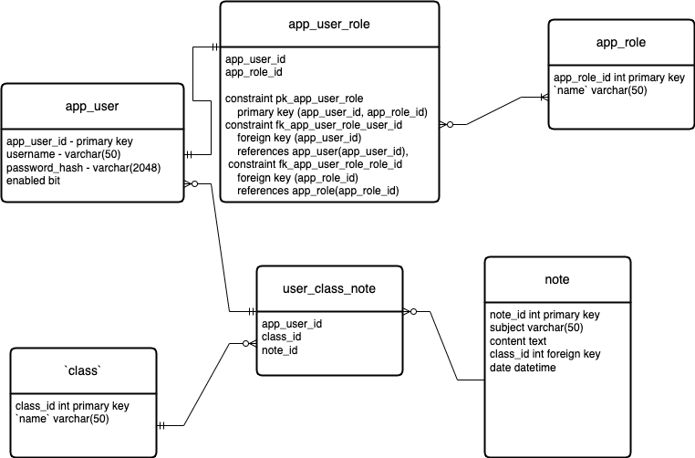
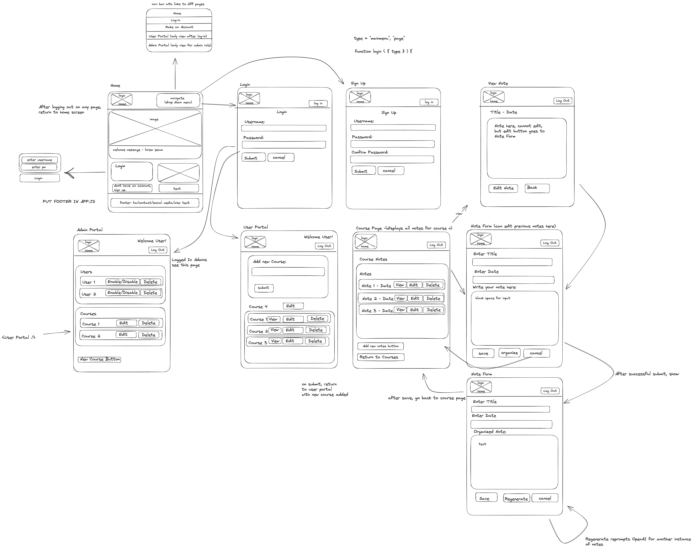

# Team Scr-AI-be App planing

## Class Tree Diagram
```
src
├───main
│   ├───java
│   │   └───learn
│   │       └───scraibe
│   │           │   App.java
│   │           │   AppConfig.java
│   │           │
│   │           ├───data
│   │           │       DataException.java 
│   │           │       AppUserJdbcTemplateRepository
│   │           │       AppUserRepository
│   │           │       CourseRepository.java
│   │           │       CourseJdbcTemplateRepository
│   │           │       NoteRepository.java
│   │           │       NoteJdbcRepository.java
│   │           |       ├───mappers
│   │           │
│   │           ├───controllers
│   │           │       AuthController
│   │           │       CourseController
│   │           │       NoteController
│   │           │       GlobalExceptionHandler 
│   │           ├───domain
│   │           │       CourseService.java
│   │           │       NoteService.java
│   │           │       ResultType.java
│   │           │       Result.java
│   │           │
│   │           ├───models
│   │           │       AppUser.java
│   │           │       Course.java
│   │           │       Note.java
│   │           │
│   │           └───security
│   │                   AppUserService
│   │                   Controller.java
│   │                   Credentials
│   │                   JwtConverter
│   │                   JwtRequestFilter
│   │                   SecurityConfig
│   │
│   └───resources
│             application.properties
└───test
    └───java
        └───learn
            └───scraibe
                ├───data
                │       AppUserJdbcTemplateRepositoryTest.java
                │       CourseJdbcTemplateRepositoryTest.java
                │       NoteJdbcRepositoryTest.java
                │
                └───domain
                │         CourseServiceTest.java
                │         NoteServiceTest.java
                │         AppUserServiceTest.java
                │         
                └───resources
                             application.properties
```
## Database Schema



### Initial Set Up
- [x] set up initial project folder, include all members and instructors as collaborators
- [x] create a "server" folder which will hold the backend project (5 min)
- [x] use `npx create-react-app client` to hold the frontend project (10 min)
- [x] push to github (2min)
- [x] set up OPENAI account jacob (10 min)
- [x] create `development` branch (1min)
- [x] off of the `development` branch make 3 branches for each developer's name `jacob`, `sue`, `julian` (1min)

### Database tasks
- [x] create schemas in mySQL database production and test. (1.5 hour)
- [x] run queries (2 min)
- [x] set up databases on each member's localmachine (30min)
### Server Tasks
- [x] Set up file structure according to tree above (30 min)
- [x] Add project dependencies to the pom file, Don't include security dependencies(will cause app to crash, if security is not implemented) (15 min)
- [x] Connect to database in application.properties, set up environment variables make sure each member is connected (30 min)
- [x] Implement models (1 hour)
- [x] Implement repositories, include CRUD Methods (1.5 hours)
- [x] Test repositories (1 hour)
- [x] Implement service classes (1.5 hours)
- [x] Test service classes (1 hour)
- [x] Implement controllers (1 hour)
- [x] Test controllers by using http files in vscode (1 hour)
- [x] Add security dependencies to the pom (10 min)
- [x] Implement security classes (1.5 hour)
- [x] Test security classes by using http files in vscode (30 min)
- [x] Enable CORS to http://localhost:3000 

## Client

### pages with routes (might need adjustment)
    HomePage "/"
    Login "/login"
    SignUp "/signup"
    UserPortal "/user-portal"
    AdminPortal "/admin-portal"
    coursePage "/course"
    NoteForm "/note-form"
    NotePage "/note-page"
    NotFound "/*"

### components
    NavBar 
    Footer
    Error

### context
    AuthContext.js

### services
    openAiApi.js
    authApi.js
    databaseApi.js

### Research
- [ ] research tailwind.css documentation/videos (1 hour)
- [ ] research openAI documentation/videos, decide what model to use and configuration settings (1 hour)

### Client Tasks
- [x] delete starter files from create react app (20 min)
- [x] use npm install for `react-router-dom v6` , `dotenv` look up documentation (5 min)
- [x] populate each component with dummy placeholder text until implemented (15min)
- [x] set up router and routes  in App.js to go to pages (30 min) (will need to adjust endpoints)
- [x] work on basic homepage that can link to login/signup (1.5 hour)
- [x] set up AuthContext and then wrap App.js so we can get the user (45min)
- [x] work on authApi.js to be able to authenticate, sign in, sign out, refresh token (2 hour)
- [x] work on basic navBar to include basic links to other pages(30 min)
- [x] work on basic login (1.5 hours)
- [x] work on basic signup (1.5 hours)
- [x] work on databaseApi.js (functions to get courses/users/notes from our database) (1 hour)
- [x] work on UserPortal (shows all courses) (2 hours)
- [x] work on CoursePage (shows all notes for a course) (2 hours)
- [x] work on NotePage (show an already saved note) (2 hours)
- [x] implement openAiApi.js (functions to make HTTP request to openAI) (2 hours)
- [x] work on NoteForm (has input fields for sending unorganized text to the openAI API, users can resend responses and then save them to the local database) (2.5 hours)
- [x] work on Admin Portal page (can implement features to edit/delete users) (2 hours)
- [x] work on footer class (1 hour)
- [x] install tailwind css
- [x] install daisyui css library
- [ ] style navbar
    - [ ] include dropdown for small screen sizes (add hamburger icon)
    - [ ] add logo hyperlink to home
- [x] style NoteForm
- [x] style ViewNote
- [x] style Login
- [x] style SignUp
- [x] style UserPortal
- [x] style AdminPortal
- [ ] style Home
    - [x] make a small login section
    - [ ] add image of example or stock image
    - [ ] add about
    - [ ] add additional description sections
    - [ ] STRETCH try me section
        -[ ] add a controller for test openAI response
- [ ] style Footer
    - [ ] add fake icons for social media
    - [ ] submit feedback form hyperlink
- [ ] NotesPage
    - [ ] stretch text-to-speech for generated notes
- [ ] add fake user data for demo
    - [ ] classes
    - [ ] notes
- [ ] gather notes of different sizes for the demo
- [ ] test product end-to-end for bugs

### adjustments
- [ ] add some margin bottom to nav bar
- [ ] adjust security config for generate notes
- [ ] update all borders for inputs to make readable
- [ ] fix 'save' button on note form
- [ ] add alerts for successful notes edited/deleted?
- [ ] cannot save/update a note in the future check to see if issue persists
- [ ] clean up unnecessary divs (navbar first) but don't break code!!!!
- [ ] update logo to use cursive "scr-ai-be" 

### WireFrame



### Domain Rules
enforce business rules and packaging them in Result<> Objects

AppUser
    add validation and functions for email field
    isValid email private method?

Note
getAll()
getByNoteId()
addNote()
editNote
deleteNote()
validate

note rules
- should have all fields not null or not blank
- date should not be in the future
- date should be in the format of YYYY-MM-DD
- note id should be 0 when adding?
- note id should not be 0 when updating/deleting.
- add/update will probably share similar validations. 

Course
getAll()
getByCourseID()
addCourse()
editCourse() do also in repository/quick test()
deleteCourse()

rules 
- needs a name not null or blank
- course id should be 0 when adding?
- course id should not be 0 when updating/deleting
- notes can be null especially when adding a new course
- course should have a userId


### needs
* repository get all users
* testRepo get all users
* service get all users
* test service
### Controllers
* AuthController (Users)
    * @RequestMapping("/users")
    * @PostMapping("/authenticate") - ResponseEntity<Object> authenticate(@RequestBody Credentials credentials) --everyone can do
    * @PostMapping("/refresh-token") - ResponseEntity<Object> refreshToken(@AuthenticationPrincipal AppUser appUser) -- only if authenticated
    * @PostMapping("/create-account") - ResponseEntity<Object> create(@RequestBody Credentials credentials) -- everyone can do
    * @GetMapping("/get-email") - ResponseEntity<Object> getByEmail(@RequestBody String email) -- temporary admin
    * @GetMapping("/get-username") - ResponseEntity<Object> getByUsername(@RequestBody String username) -- temporary admin
    * @GetMapping() - ResponseEntity<Object> getAll() - only admin
    * @PutMapping("/edit/{id}")  - ResponseEntity<Object> editUser(@PathVariable int id, @RequestBody AppUser appUser) - only authenticate
    * @DeleteMapping("/delete/{id}") - ResponseEntity<Object> deleteUser(@PathVariable int id) - only admin
* CourseController -- only authenticated
    * @RequestMapping("/courses")
    * @GetMapping() - ResponseEntity<Object> getAll()
    * @GetMapping("/{id}") - ResponseEntity<Object> getCourseById(@PathVariable int id)
    * @PostMapping() - ResponseEntity<Object> addCourse(@RequestBody Course course)
    * @PutMapping("/{id}")  - ResponseEntity<Object> editCourse(@PathVariable int id, @RequestBody Course course)
    * @DeleteMapping("/{id}") - ResponseEntity<Object> deleteCourse(@PathVariable int id)
* NoteController -- only authenticated
    * @RequestMapping("/notes")
    * @GetMapping() - ResponseEntity<Object> getAll()
    * @GetMapping ("/{id}") - ResponseEntity<Object> getNoteById(@PathVariable int id)
    * @PostMapping() - ResponseEntity<Object> addNote(@RequestBody Note note)
    * @PutMapping("/{id}")  - ResponseEntity<Object> editNote(@PathVariable int id, @RequestBody Note note)
    * @DeleteMapping("/{id}")- ResponseEntity<Object> deleteNote(@PathVariable int id)
* OpenAIController -- only authenticated
   *  @RequestMapping("/generate-completion")
   *  @PostMapping public ResponseEntity<Object> generateCompletion(@RequestBody Note note)


### Stretch Goals after MVP
- reorganize user schema to show firstname/lastname on load.
- text-to-speech tts technology.

### fixes
-update sql to not use user_course_note
- update not repository to not use bridge


### weekend work
* admin sue can only sign teacher123.
* user julian.
* course/note form jacob.
* install research tailwind.
* accessability research implementation. stretch